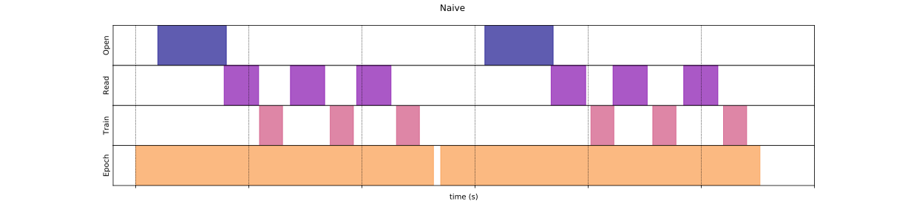
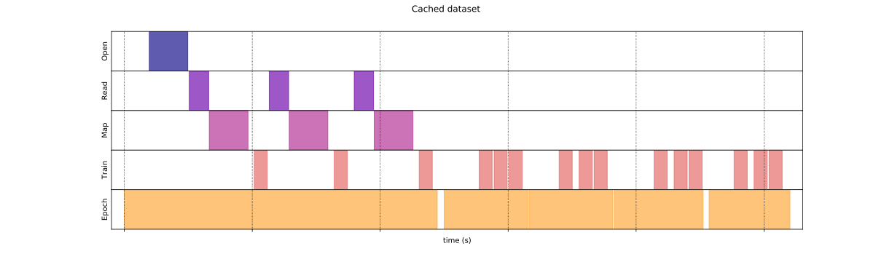
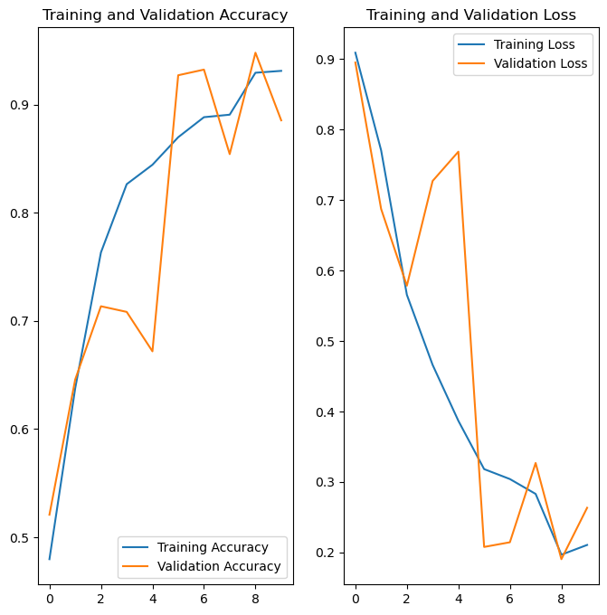

#  **Vegetable Disease Classification** 

## 📌 **Problem Statement**  
Agricultural diseases significantly impact crop yields, leading to **economic losses** for farmers.  
This project aims to **develop an AI-powered application** that enables **farmers to detect diseases in potato, tomato, and apple leaves** at **early stages** using **deep learning**.  

The ultimate goal is to **build a unified model** that can classify multiple vegetable diseases and deploy it as an easy-to-use **mobile or web application**.  

The dataset is sourced from **[Kaggle](https://www.kaggle.com/arjuntejaswi/plant-village)**.  

---

## 📌 **Table of Contents**  
- [Dataset and Preprocessing](#dataset-and-preprocessing)  
- [Model Architecture](#model-architecture)  
- [Training and Performance](#training-and-performance)  
- [Model Deployment](#model-deployment)  
- [How to Run the Project](#how-to-run-the-project)  
- [Results and Visualization](#results-and-visualization)  
- [Project Timeline and Future Improvements](#project-timeline)  

---

## 📂 **Dataset and Preprocessing**  

### 1️⃣ **Loading the dataset**  
- The dataset is loaded using TensorFlow’s `image_dataset_from_directory()`, which **efficiently loads images in batches** instead of keeping the entire dataset in memory.  
- This **batch-loading mechanism optimizes RAM usage**, making the process **faster and more memory-efficient**, especially for large datasets.  

### 2️⃣ **Splitting the dataset**  
- The dataset is split into:  
  - **Training set (80%)**  
  - **Validation set (10%)**  
  - **Test set (10%)**  

### 3️⃣ **Optimization for Faster Training**  
- Data is **cached, shuffled, and prefetched** to improve efficiency.  

#### 🔍 **Why Optimize?**  
✅ **Reduces training bottlenecks** by optimizing data loading.  
✅ **Increases GPU utilization** by ensuring the GPU always has data to process.  
✅ **Speeds up training** by avoiding I/O delays.  

#### Without Cache 

#### With Cache 

### 4️⃣ **Data Augmentation**  
- **Random flipping and rotation** are applied to prevent overfitting.  

---

## 🧠 **Model Architecture**  

- A **Convolutional Neural Network (CNN)** is implemented with multiple **convolutional and max-pooling layers**, followed by **fully connected layers** for classification.  
- The final output layer uses **softmax activation** for multi-class classification.  

### **Model Components:**  
✅ **Convolutional layers** for feature extraction  
✅ **Max-pooling layers** to reduce spatial dimensions  
✅ **Fully connected layers** for classification  
✅ **Softmax activation** for multi-class output  

---

## 📊 **Training and Performance**  

### 1️⃣ **Optimization Algorithms Tested**  
- **Adam** (Adaptive learning rate optimization)  
- **SGD** (Stochastic Gradient Descent)  

### 2️⃣ **Loss Function Used**  
- **SparseCategoricalCrossentropy** for multi-class classification.  

### 3️⃣ **Model Performance**  
Training vs. Validation Accuracy and Training vs. Validation Loss  

---

## 📅 **Project Timeline**  

### 1️⃣ **Create a Preliminary Model**  
- Start with **Potato Disease Classification**  
- Dataset preprocessing, model architecture, training, and evaluation.  
- Deploy the model as a **TensorFlow Lite model for mobile/web use**.  

### 2️⃣ **Implement the Web Application**  
- Develop a **user-friendly interface** where farmers can upload images and get real-time disease predictions.  
- Use **Flask / FastAPI / TensorFlow.js** for model integration.  

### 3️⃣ **Extend to Tomato and Apple Classification**  
- Expand the dataset to include **tomato and apple leaf diseases**.  
- Train individual models for each vegetable.  

### 4️⃣ **Merge All Models into One**  
- Compress and unify **potato, tomato, and apple disease detection models** into a **single model**.  
- Optimize for **low-latency predictions** on mobile and web applications.  

### 5️⃣ **Final Project Deployment**  
- Deploy the **web and mobile application** with the trained model.  
- Ensure a smooth **user experience** with **fast and accurate predictions**.  

## 🚀 **Tech Stack**  

 - **Programming Languages**: Python, JavaScript
 - **Deep Learning Framework**: TensorFlow 
 - **Backend Frameworks**: Flask, FastAPI 
 - **Frontend**: HTML, CSS, JavaScript (React/Next.js) 
 - **Deployment**: TensorFlow Lite (Mobile), Docker (Cloud Deployment) 

## 📢 **Acknowledgments**  
- **Dataset:** [PlantVillage Dataset on Kaggle](https://www.kaggle.com/arjuntejaswi/plant-village)  
- **TensorFlow Documentation:** [TensorFlow API](https://www.tensorflow.org/api_docs/python/tf/keras)  
- **CNN Basics:** [YouTube - CNN for Image Classification](https://www.youtube.com/watch?v=zfiSAzpy9NM)  
